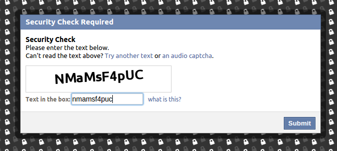

# php-captcha generate random characters + numbers

php-captcha - generate security code using PHP


## How to use:

#### PHP GD create a simple image with GD library
##### To Install Extension "GD" if not found it in your server
to check if enable "GD" or not type on command line:
```bash
php --ri GD
```
if result "GD Support => enabled" AND some info, 
it is already installed & enabled, do not try this steps to installation

###### on Debian linux ~ # 
```bash
sudo apt-get install php5-gd
sudo service apache2 restart
```
###### on Redhat linux ~ # 
```bash
sudo yum install php-gd
```
 or to PHP5
```bash
sudo yum install php5-gd
```
 and restart apache server
```bash
sudo /etc/init.d/apache2 restart
```
read more: http://php.net/manual/en/image.installation.php

### This Screenshot


